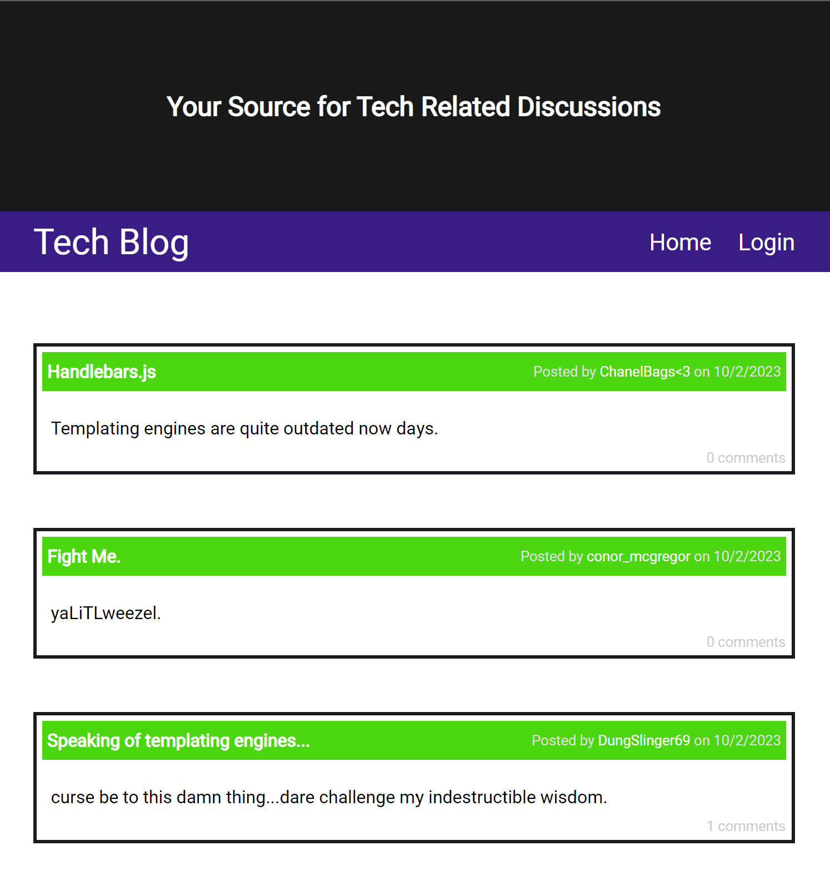
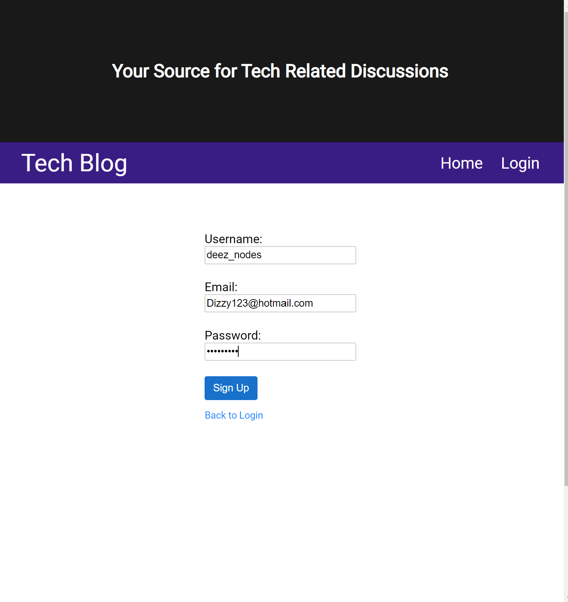
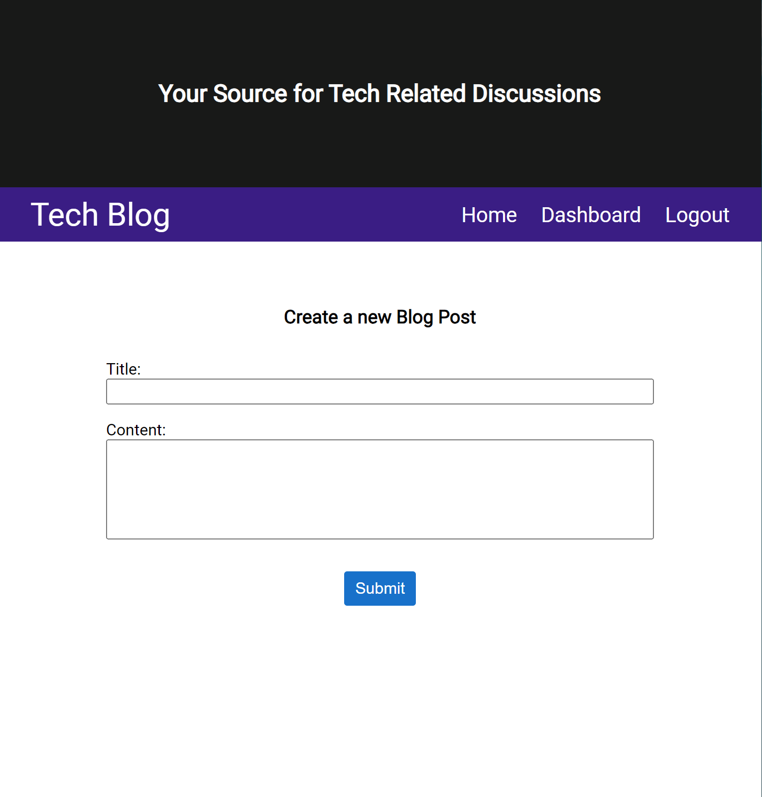
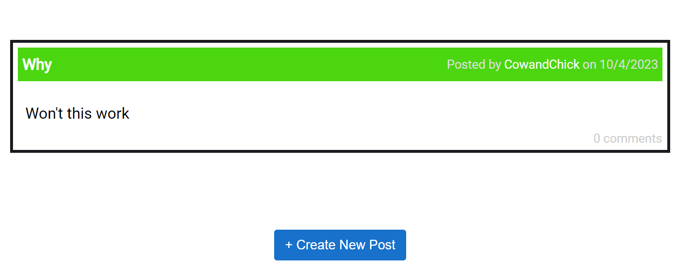
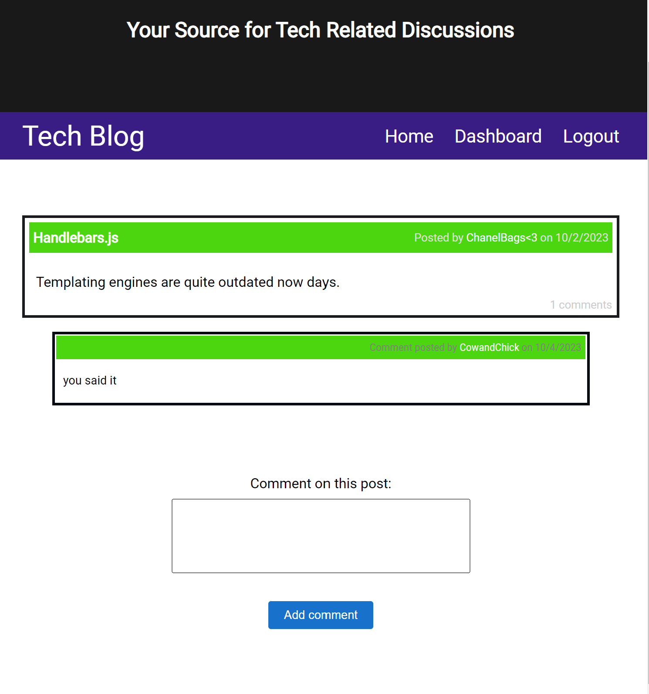
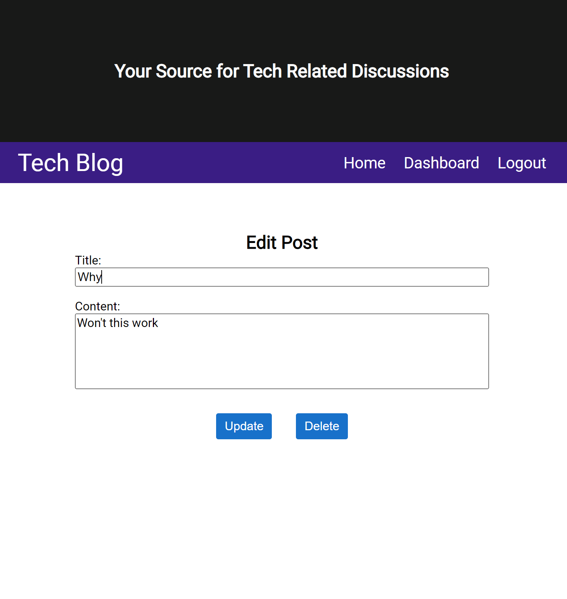

# Blog About Tech

## Description

MVC designed full stack web application. Create, share, and comment on blog posts with other users. Relational database models constructed with Sequelize.js. Routes and controllers written with Express.js. View displayed on the frontend, through server-side rendering, using Handlebars.js. Express-session middleware for server-side session storage. Hosting done with Heroku.

## Link to the Deployed Application

- [Click Here]()

## Usage

- #### Click on the link above to redirect to the Heroku deployed application.

- #### Signup for a new account to access the website.

- #### Create a new blog post or leave a comment on a post made by another user.

- #### Navigate into the dashboard, to edit or delete a post.

## Credits

- With the help from my colleagues at the UNC coding bootcamp youtube, docs, and chatGPT.

## License

This application is covered under the [MIT License](./LICENSE).
